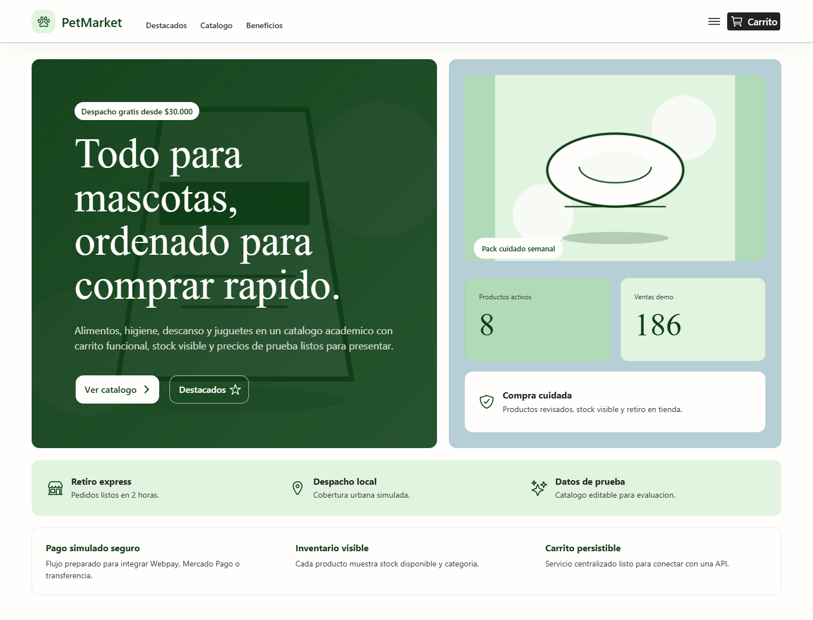
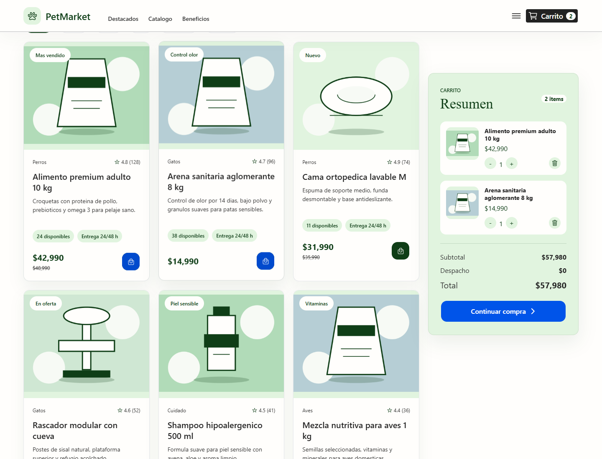
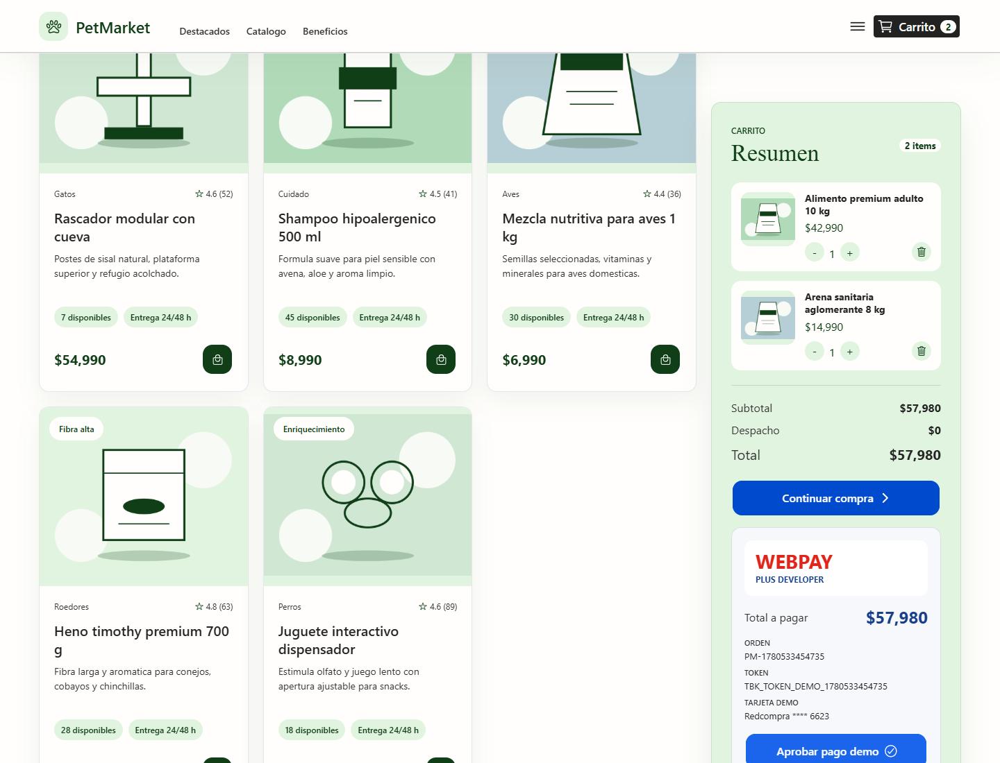
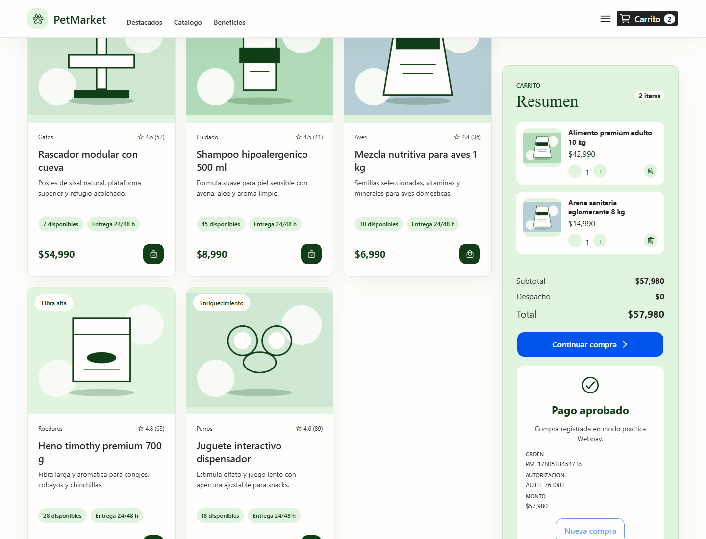

# PetMarket

PetMarket es una aplicacion academica de venta de insumos para mascotas creada desde cero con Angular e Ionic. Incluye catalogo de productos, carrito de compra, checkout de practica y un flujo simulado de pago estilo Webpay Plus Developer.



## Caracteristicas

- Catalogo de productos para perros, gatos, aves, roedores y cuidado.
- Busqueda por texto y filtro por categoria.
- Productos destacados con tarjetas visuales.
- Carrito con cantidades, subtotal, despacho y total.
- Checkout con datos del comprador.
- Simulador Webpay de practica con token, orden y comprobante.
- Diseno responsive para escritorio y movil.

## Capturas

### Carrito de compra



### Pago Webpay de practica



### Comprobante de pago



## Tecnologias

- Angular
- Ionic
- TypeScript
- SCSS
- Ionicons
- Playwright para capturas del README

## Instalacion

```bash
npm install
```

## Ejecutar en desarrollo

```bash
npm run start
```

La app queda disponible en:

```text
http://localhost:4200
```

## Compilar

```bash
npm run build
```

La salida de produccion se genera en `www/`.

## Flujo de compra

1. Agregar productos desde el catalogo.
2. Presionar el boton `Carrito` del header o bajar al panel del carrito.
3. Presionar `Continuar compra`.
4. Completar los datos del comprador.
5. Crear el pago Webpay de practica.
6. Aprobar el pago demo.
7. Ver el comprobante.

## Webpay

El pago implementado es un simulador frontend para practica academica. No procesa pagos reales ni usa credenciales de Transbank.

Para integrar Webpay real se necesita un backend que cree y confirme transacciones usando el SDK oficial de Transbank. Las credenciales nunca deben quedar expuestas dentro de Angular.

## Regenerar capturas

Con la app corriendo en `http://localhost:4200`, ejecutar:

```bash
node scripts/capture-readme.mjs
```

Las imagenes se guardan en `docs/images/`.

## Estructura principal

```text
src/app/data/products.ts          Datos de prueba del catalogo
src/app/services/cart.service.ts  Estado y operaciones del carrito
src/app/pages/store/              Pantalla principal de tienda
src/assets/products/              Imagenes de productos
docs/images/                      Capturas usadas en el README
```
